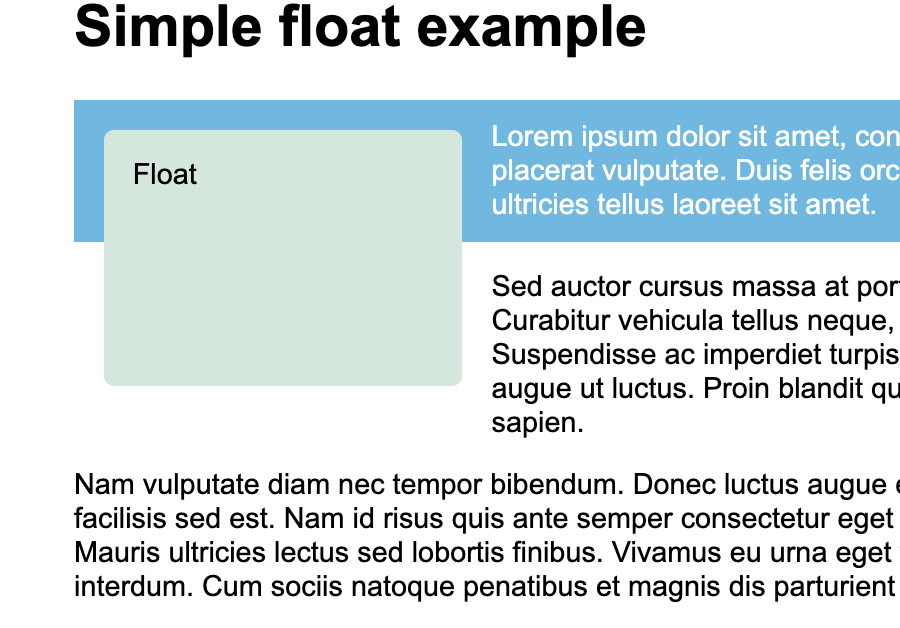

Content mostly comes from [Learn to style HTML using CSS](https://developer.mozilla.org/en-US/docs/Learn/CSS) by Mozilla Contributors  which is licensed under CC-BY-SA 2.5.

# Table Of Content:
- [CSS Basics](#css-basics)
	* [What is CSS](#what-is-css)
		+ [Styling Things Based on their Location in a Document](#styling-things-based-on-their-location-in-a-document)
		+ [Styling Based on State](#styling-based-on-state)
		+ [Combining selectors and combinators](#combining-selectors-and-combinators)
	* [How CSS Is Structured](#how-css-is-structured)
		+ [Applying CSS to HTML](#applying-css-to-html)
		+ [Selectors](#selectors)
		+ [CSS Functions](#css-functions)
		+ [rules](#rules)
		+ [Shorthands](#shorthands)
		+ [Comments and Whitespace](#comments-and-whitespace)
	* [How CSS Works](#how-css-works)
		+ [How Does it Actually Work](#how-does-it-actually-work)
- [CSS Building Blocks](#css-building-blocks)
	* [Cascade and Inheritance](#cascade-and-inheritance)
		+ [Conflicting Rules](#conflicting-rules)
		+ [Understanding Inheritance](#understanding-inheritance)
		+ [Understanding the Cascade](#understanding-the-cascade)
		+ [The effect of CSS location](#the-effect-of-css-location)
	* [CSS Selectors](#css-selectors)
		+ [What's a Selector](#what's-a-selector)
		+ [Selector Lists](#selector-lists)
		+ [Types of Selectors](#types-of-selectors)
			* [Type, Class and ID Selectors](#type-class-and-id-selectors)
			* [attribute Selectors](#attribute-selectors)
			* [Pseudo-classes and Pseudo-elements](#pseudo-classes-and-pseudo-elements)
		+ [Combinators](#combinators)
		+ [Summary Table](#summary-table)
		+ [More on Pseudos](#more-on-pseudos)
		+ [A Combinators Primer](#a-combinators-primer)
	* [The Box Model](#the-box-model)
		+ [Block and Inline Boxes](#block-and-inline-boxes)
		+ [Inner and Outer Display Types](#inner-and-outer-display-types)
		+ [What is the CSS Box Model](#what-is-the-css-box-model)
		+ [Margins, Padding and Borders](#margins-padding-and-borders)
			* [Margins](#margins)
			* [Borders](#borders)
			* [Padding](#padding)
		+ [The Box Model and Inline Boxes](#the-box-model-and-inline-boxes)
		+ [Using Display `inline-block`](#using-display-inline-block)
	* [Backgrounds](#backgrounds)
		+ [`background-color`](#background-color)
		+ [background images](#background-images)
		+ [Gradient Backgrounds](#gradient-backgrounds)
	* [Overflowing Content](#overflowing-content)
		+ [The `overflow` Property](#the-overflow-property)
	* [Values and Units](#values-and-units)
		+ [Numbers, lengths, and percentages](#numbers-lengths-and-percentages)
			* [Length Values](#length-values)
			* [Percentages](#percentages)
			* [Numbers](#numbers)
		+ [Color Primer](#color-primer)
			* [Hexadecimal RGB](#hexadecimal-rgb)
			* [RGB and RGBA](#rgb-and-rgba)
			* [HSL and HSLA](#hsl-and-hsla)
		+ [Strings and Identifiers](#strings-and-identifiers)
	* [Element Sizing](#element-sizing)
		+ [Intrinsic Size of Things](#intrinsic-size-of-things)
		+ [Setting a Specific Size](#setting-a-specific-size)
		+ [Using Percentages](#using-percentages)
		+ [Minimum and Maximum Sizes](#minimum-and-maximum-sizes)
		+ [Viewport Units](#viewport-units)
	* [Styling Tables](#styling-tables)
		+ [Spacing and Layout](#spacing-and-layout)
		+ [Zebra Scripting](#zebra-scripting)
	* [Debugging CSS](#debugging-css)
		+ [Debugging through Dev Tools](#debugging-through-dev-tools)
		+ [Specificity Issues](#specificity-issues)
		+ [Suggested CSS Debugging Workflow](#suggested-css-debugging-workflow)
	* [Organizing CSS](#organizing-css)
		+ [Tips to Keep CSS Tidy](#tips-to-keep-css-tidy)
			* [Stick to a Style Guide](#stick-to-a-style-guide)
			* [Stay Consistent](#stay-consistent)
			* [Format Readable CSS](#format-readable-css)
			* [Comment Generously](#comment-generously)
			* [Divide a Stylesheet ingo Logical Sections](#divide-a-stylesheet-ingo-logical-sections)
			* [Avoid Overly-specific Selectors](#avoid-overly-specific-selectors)
			* [Break Large Stylesheets into Multiple Smaller Ones](#break-large-stylesheets-into-multiple-smaller-ones)
		+ [Other Tools for Organizing CSS](#other-tools-for-organizing-css)
			* [CSS Methodologies](#css-methodologies)
			* [Build Systems for CSS](#build-systems-for-css)
- [Styling Text](#styling-text)
		+ [How is Text Styled](#how-is-text-styled)
		+ [Fonts](#fonts)
			* [Color](#color)
			* [Font Families](#font-families)
			* [Font Size](#font-size)
			* [Font Style, Font Weight, Text Transform, and Text Decoration](#font-style-font-weight-text-transform-and-text-decoration)
			* [Text Shadows](#text-shadows)
		+ [Text Layout](#text-layout)
			* [Text Alignment](#text-alignment)
			* [Line Height](#line-height)
			* [Letter and Word Spacing](#letter-and-word-spacing)
		+ [Font Shorthand](#font-shorthand)
	* [Styling Lists](#styling-lists)
		+ [List Spacing](#list-spacing)
		+ [List Specific Properties](#list-specific-properties)
		+ [`list-style` Shorthand](#list-style-shorthand)
		+ [Controlling List Counting](#controlling-list-counting)
	* [Styling Links](#styling-links)
		+ [The Basics of Link Styling](#the-basics-of-link-styling)
			* [Link States](#link-states)
			* [Default Styles](#default-styles)
			* [Styling Links](#styling-links)
	* [Web Fonts](#web-fonts)
- [CSS Layout](#css-layout)
	* [Intro](#intro)
		+ [Normal Flow](#normal-flow)
		+ [The display Property](#the-display-property)
		+ [Flexbox](#flexbox)
		+ [Grid Layout](#grid-layout)
		+ [Floats](#floats)
		+ [Positioning Techniques](#positioning-techniques)
		+ [Table Layout](#table-layout)
		+ [Multi-column Layout](#multi-column-layout)
	* [Normal Flow](#normal-flow)
	* [Flexbox](#flexbox)
		+ [Why Flexbox](#why-flexbox)
		+ [Basic Terminology](#basic-terminology)
		+ [Columns or Rows](#columns-or-rows)
		+ [Wrapping](#wrapping)
		+ [Flex-flow Shorthand](#flex-flow-shorthand)
		+ [Flexible Sizing of Flex Items](#flexible-sizing-of-flex-items)
		+ [`flex` Shorthand vs Longhand](#flex-shorthand-vs-longhand)
		+ [Horizontal and Vertical Alignment](#horizontal-and-vertical-alignment)
		+ [Ordering Flex Items](#ordering-flex-items)
		+ [Nested Flex Boxes](#nested-flex-boxes)
		+ [Cross Browser Compatibility](#cross-browser-compatibility)
	* [Grid Layout](#grid-layout)
		+ [What Is a Grid](#what-is-a-grid)
		+ [Creating a CSS grid](#creating-a-css-grid)
			* [Flexible Grids with The `fr` Unit](#flexible-grids-with-the-fr-unit)
			* [Gaps Between Tracks](#gaps-between-tracks)
			* [Repeating Track Listing](#repeating-track-listing)
			* [The Implicit and Explicit Grid](#the-implicit-and-explicit-grid)
			* [The `minmax()` Function](#the-minmax()-function)
			* [As Many Columns as Will Fit](#as-many-columns-as-will-fit)
	* [Line Based Placement](#line-based-placement)
			* [Positioning with `grid-template-areas`](#positioning-with-grid-template-areas)
		+ [A Built-in Grid Framework](#a-built-in-grid-framework)
	* [Floats](#floats)
		+ [Simple Floating](#simple-floating)
		+ [Clearing Floats](#clearing-floats)
		+ [Clearing Boxes Wrapped Around a Float](#clearing-boxes-wrapped-around-a-float)
	* [Positioning](#positioning)
		+ [Introducing Positioning](#introducing-positioning)
		+ [Static Positioning (`position static`)](#static-positioning-(position-static))
		+ [Relative Positioning](#relative-positioning)
			* [Media Types](#media-types)
			* [Media Feature Rules](#media-feature-rules)
		+ [More Complex Media Queries](#more-complex-media-queries)
		+ [How to Choose Breakpoints](#how-to-choose-breakpoints)
		+ [Do You Really Need Media Queries](#do-you-really-need-media-queries)
	* [Supporting Older Browsers](#supporting-older-browsers)

# CSS Basics:
- This will not be an exhaustive treatment of CSS. I will only focus on weird, interesting or challenging parts.

## What is CSS?
- CSS is for style.
- CSS is a rule-based language. It helps you define rules specifying groups of styles to elements or groups of elements. The following code shows a CSS rule:
```css
h1 {
	color: red;
	font-size: 5em;
}
```
- The rule above has the following parts:
	+ A ***selector*** is the element to be styled. In this case it is the `<h1>`.
	+ The curly braces ***`{ }`*** one or more declarations. In this example two declarations are enclosed inside the curly braces.
	+ A ***declaration*** takes the form of a ***property*** and ***value*** pair. Each property defines a property of the element (such as its size or color) and a value to be given to that value.
- CSS is also vast, so it's broken into modules. 
- **Element selectors** target and style HTML elements. To target all paragraphs in a document, you do it with the `p` selector, for example.
- Multiple selectors can be targeted at once using commas as in:
```css
p, h1 {
	font-size: 2em;
}
```
- HTML has default styling that it applies to elements. With CSS you can change this default behavior. An example of such a change can be applied to list items in a list as in the following example with the the bullets would be removed from list items or in anchors where underlining gets removed as in the following example:
```css
li {
	list-style: amharic-abegede;
}

a {
	text-decoration: none;
}
```
- A **class** is an attribute that can be added to any element and its value can be can be targeted using a class selector in CSS. The class selector is preceded by a dot as in:
```css
.special {
	color: blue;
}
```
- Any element that has a class attribute whose value is `special` will have the color blue.
- A class selector can target certain elements, so that only the given elements with that class will be targeted. This is done as follows:
```css
li.special {
	color: red;
}
```
- If you want to give the same styling to another particular element, you'd add it to the list of elements with the class appended to them as in:
```css
li.special, h1.special {
	color: red;
}
```
- Obviously, the general class `special` will still apply to other elements, meaning that their color stays blue.
- It is not recommended to tie classes to specific elements.

### Styling Things Based on their Location in a Document:
```css
li em {
  color: rebeccapurple;
}
```
- In the example above, a **descendant combinator** which is a space between two selectors,  allows us to target all elements of type `<em>` that are nested inside elements of type `li`.
- Another cool example of location based selector targeting is the so-called **adjacent sibling combinator**. This one targets an element that directly follows another type of element. In the following example, we are targeting only paragraphs that come exactly after elements of type `<h1>`:
```css
h1 + p {
	color: red;
}
```

### Styling Based on State:
- Some elements have different states based on different criteria. An anchor link `<a>` for example has different states based on user interaction. Visited, unvisited, hovered over... etc. are some of these states, and they can be accessed with the element name and its state separated with a column as in: 
```css
a:link {
  color: blue;
}

a:visited {
  color: red;
}

a:hover {
	color: red;
}
```

### Combining selectors and combinators:
- Nesting selectors and using multiple combinators together with other selectors can get confusing, but the rules are consistent. The following examples are explained in the associated comments:
```css
/* Apply style to em that is inside a span that is inside a paragraph*/
p span em { ... }
/* Select em elements which are inside paragraphs and which immediately follow h1 elements. */
h1 + p em { ... }

/* select elements of class special that are inside paragraphs which immediately follow h1 elements. */
body h1 + p .special {
  color: yellow;
  background-color: black;
  padding: 5px;
}
```

## How CSS Is Structured:
### Applying CSS to HTML:
- There are 3 ways you can apply css to HTML:
	1. **External stylesheets** where an external stylesheet file is linked and can be applied to a whole website. Changes to this file would apply to the whole website. This is easiest to maintain and most efficient way to use css. A cs sheet can be linked with the link attribute which is inserted in a document's head as in : `<link rel="stylesheet" href="index.css">`.
	2. **Internal stylesheet** where a style element is inserted into a document's head. This element has an attribute type whose value is usually "text/css". This not as good as the previous way, but you might have to do it when, for example, using a CMS that doesn't allow you to change external stylesheet easily. This is hard to maintain as changes would appear in some places and not others.
	3. **Inline styling** where you embed styling into elements with the style attribute whose value is a declarations separated by semi-colons. This is extremely BAD and should be avoided at all costs.

### Selectors:
- Valid selectors include:
```css
h1 { ... }
a:link { ... }
.manythings { ... }
#onething { ... }
* { ... }
.box p { ... }
.box p:first-child { ... }
h1, h2, .intro { ... }
```
- If two selectors target the same element, the one defined last overrides the earlier one. CSS is said to **cascade**. In the following example, `<p>` will be colored blue:
```css
p {
	color: red;
}

p {
	color: blue;
}
```
- Cascading works when the two selectors are of the same time type. If they are different element types with different **specificities**, the elements with higher specificity override those with less specificity regardless of which ones appear first. Classes for example have a higher specificities than element selectors. The rules of cascading and specificity are discussed in more detail [here](#cascade-and-inheritance).

### CSS Functions:
- CSS also has **functions** that do calculations and nifty things. An example is the `calc()` function which would calculate different values based on needs as in `.box {width: calc(90% - 20px)}`. This function calculates the width of an element using 90 % of the parent element and subtract 20 pixels from that. Other

### @rules:
- Pronounced as "at-rules", `@rules` are special rules for how css should behave.
- `@import 'somestylesheet.css';`, for example, is used to import an additional stylesheet into the main stylesheet.
- Another improtant @rule is `@media` which allows you to use **media queries** (a topic for a later discussion). With media queries, you can apply CSS only when certain conditions are true.

### Shorthands:
- Some properties like font, border, background, padding, margin ..etc. allow for the use of shorthand properties. Instead of specifying several seprate properties, they can all be lumped together in one precise on as in the following two examples:
```css
padding: 10px 15px 15px 5px;
/* is is more into the brevity thing than */
padding-top: 10px;
padding-right: 15px;
padding-bottom: 15px;
padding-left: 5px;
```
- If the shorthand involves the sides of an element, you'd move clockwise starting at the top as in the example above.
- The following example is more complicated:
```css
background: red url(bg-graphic.png) 10px 10px repeat-x fixed;
```
is the terse version of:
```css
background-color: red;
background-image: url(bg-graphic.png);
background-position: 10px 10px;
background-repeat: repeat-x;
background-scroll: fixed;
```
- Learning these shorthands is a matter of practice.

### Comments and Whitespace:
- Comments are obviously useful. One recommandation MDN gives is separating the code into sections with comment lines as in :
```css
/* Basic elements Section--------------------------------------------*/
body { ... }
h1 { ... }
p { ... }
/* Classes -------------------------------------------------------------------*/
.box { ... }
.bags { ... }
.other { ... }

```
- White space is essential for code readability. It includes spaces, tabs and newlines. Be careful about white spaces in properties and their values. `margin: 0auto;` is not the same as `margin: 0 auto;`

## How CSS Works:
- This section investigates how CSS and HTML are parsed by the browser and how the latter acts when it encounters CSS it doesn't understand.

### How Does it Actually Work?
- Before a document is displayed by the browser, it is processed through multiple stages. The following is a rough list of what happens to a document inside a browser:
	1. The browser loads the HTML document.
	2. It converts the HTML into a DOM (which is a representation of the document in memory).
	3. It then fetches the linked resources such as images, videos and CSS sheets. Javascript is handled later.
	4. CSS is parsed and sorted by the different selectors (elements, ids, classes) into buckets. It attaches different styles to different DOM nodes as required in a process called **render tree**.
	5. The display is shown on the screen in the **painting** process.
- Every element, piece of text and attribute becomes a DOM node which is defined by its relationship to other nodes. It can be a parent, a child or a sibling of another node. Understanding the dom is a prerequisite 
- When the browser encounters a wrong property or value, it doesn't understand, it simply ignores the whole declaration and if a rogue selector is encountered, the whole rule is ignored and the rest of CSS gets parsed as normal. No error is produced. This is useful as features which are not supported by all browsers wouldn't have a negative effect and the the errors would stay localized.

# CSS Building Blocks:
- This module is focused on an in-depth dive into the theory and general rules of CSS. This is the meat of styling. Topics such as inheritance, cascading, selectors, the box model, overflowing, units and values, sizing items ..etc. are all discussed here in depth.

## Cascade and Inheritance:
- Spending time trying to understand these rules might sound like a cringy academic luxury, but it is crucial. I had first hand experience of *existential doubts about life* caused by such conflicts between cascade and specificity.

### Conflicting Rules:
- CSS problems usually arise because of clashes between multiple rules applied to a single element. Three fundamental concepts can help us clear the waters on such conflicts:
	+ **The cascade** refers to the fact that the order of CSS rules matters. If two styles are applied to the one element, the style defined last holds and overrides the one used earlier.
	+ **Specificity** applies when multiple rules have different selectors, but could apply to the same element. It is a score of how specific a selector is. An element selector is less specific because it selects all individual elements in a page. A class is less specific since it only selects elements that belong to a certain class. Specificity is stronger than cascade.
	+ **Inheritance** refers to the fact that some properties are inherited from parent elements unless specific values are applied to the children. Some properties are not inherited such as width and border (That would result in some interesting messes).

### Understanding Inheritance:
- Certain properties are inherited by default such as color. Others like margins, borders and padding don't. What gets inherited and what doesn't all come down to common sense.
- You can even **control how inheritance** works through the following property values:
<dl>
	<dt>`inherit`:</dt>
	<dd>Turns inheritance on. The default of every property is to be inherited from parent.</dd>
	<dt>`initial`:</dt>
	<dd>Sets the default browser styling</dd>
	<dt>`unset`:</dt>
	<dd>Resets property to its natural property. If naturally inherited, it acts as `inherit`, otherwise, it acts as `unset`.</dd>
</dl>
- The property `all` can reset the values of all the properties of a selector to one of these values (`inherit`, `unset` or `initial`). "It's a convenient way to undo changes made to styles so that you can get back to a known starting point before beginning new changes." See [MDN](https://developer.mozilla.org/en-US/docs/Learn/CSS/Building_blocks/Cascade_and_inheritance).

### Understanding the Cascade:
- Three factors affect how the cascade behaves. They are in order of decreasing importance: **importance**, **specificity**, **source order**.
- **Source order**: What comes last wins. Elements that are closer to the element override old ones that were encountered earlier.
- **Specificity** beats source order. Even if a higher specificity rules comes after another one with lower specificity, it wins. For example, class selectors have higher specificity than element selectors.
	+ When a selector overrides another due to specificity, not the whole rule is overridden. Only the properties that are the same get overridden.
	+Specificity helps avoid repetition. You define a rule that applies to all instances of an element. For those you need specific rules, you define a class or classes for them.
	+ The browser calculates the specificity of selector through the use of a point system. Different points are awarded to a selector based on their type. These points are added to reach its final value. There are four different values for measuring specificity:
		- **Thousands**: used for any declaration that is defined in-line inside a style attribute. It simply gets a score of a 1000.
		- **Hundreds**: for each ID selector inside the overall selector.
		- **Tens**: for each class selector, attribute selector or a pseudo-class contained in the overall selector.
		- **Ones**: for each element or pseudo-element contained in the overall selector.
- **`!important`** is a keyword you can use to override all other factors and rules. The following example from MDN shows its syntax:
```css
.better {
    background-color: gray;
    border: none !important; /* It is appended to the property's value.*/
}
```
- `!important` overrides everything else and the only way to overrides it is to use it in a declaration with a higher specificity or including it in a declaration with the same specificity but later in a file.
- `!important` is bad and hacky. Avoid it like the plague!
- There are situation when using it is essential, such as when working with CMS where you can't overrides styles provided to you.

### The effect of CSS location:
- It is important to consider in what stylesheet a CSS declaration  is defined in.

## CSS Selectors:
- It's all about selectors, mate!

### What's a Selector?
- The first part of a CSS rule, a selector is a pattern of elements and other things that tell the browser which HTML elements to apply some styling to. Elements selected by a selector are the subject of a selector.


### Selector Lists:
- If you have more than one thing that use the same CSS, you can apply the same CSS with a shorthand list as in:
```css
h1, h3, .heading {
	color: red;
}
```
- For better readability, this can also be written as:
```css
h1,
h3,
.heading {
	color: red;
}
```
- Be careful about selector lists. If one selector is invalid, the whole rule is ignored for all the selectors present in the list.

### Types of Selectors:
- Selectors can be grouped together into types that share certain characteristics. These groupings are as follows:

#### Type, Class and ID Selectors:
- These include selectors that target elements as in `h1 { ... }`, selectors that target classes as in `.someClass { ... }`, and selectors that target ID's as in `#someID { ... }`.

#### attribute Selectors:
- These can be used to select elements based on the presence of certain attributes as in:
```css
a[title] { ... }
```
- They also allow you to select elements based on the presence of certain value properties as in:
```css
a[href="https://example.com"] { ... }
```

#### Pseudo-classes and Pseudo-elements:
- **Pseudo-classes** select certain states of an element, such as the `:hover` pseudo-class.
- **Pseudo-elements** select parts of elements rather than whole elements. The `::first-line` for example selects the first line a paragraph (as shown in the viewport) as in:
```css
p::first-line{
	color: red;
}
```

### Combinators:
-  Refers to combinations of selectors. The following targets all paragraphs that are direct children of the article element:
```css
article > p { ... }
```

### Summary Table:
- The following is a summary table of selectors:

| Selector | Example
| --- | --- |
| Type selector | `p { ... }`
| Universal selector | `* { ... }`
| Class selector | `.box { ... }`
| Id selector  | `#unique { ... }`
| Attribute selector | `a[title] { ... }`
| Pseudo-classes selector | `p:first-child { ... }`
| Pseudo-element selector | `p::first-line { ... }`
| Descendant combinator | `article p { ... }`
| Child combinator | `article > p { ... }`
| adjacent sibling combinator | `h1 + p { ... }`
| general sibling | `h1 ~ p`

### More on Pseudos:
- **Pseudo-classes** select elements based on their state. They are the first of their kind, or being hovered over. Some pseudo-classes target a part of your document like first or last line of a paragraph and act if you added a new class to style that portion. These include pseudo-classes like `:last-child` and `:only-child`. Other pseudo-classes react to the user's interaction with the document. They act as if a class were added to the document when the user interacts with it. These include `:hover` and `:focus`.
- **Pseudo-elements** act a little similar to pseudo-classes, but they act as if a whole new element were added to the document rather than applying a new class to an existing element. An interesting example of pseudo-elements is the `::first-line`. It's aware of the viewport while a span element can't style it differently and keep that across different screen widths.
- **Pseudo-elements and pseudo-classes can be combined** to do some crazy stuff like making the first line of the first paragraph of an article bold as in:
```css
article p:first-child::first-line { 
  font-size: 120%; 
  font-weight: bold; 
}
```
- There are two special pseudo-classes that act as if they insert new content into a document. These are **`::before`** and **`::after`**. They are used with the content property to insert content into a document before or after the content of the element they target. Basically, `::before` and `::after` have a spatial rather than temporal meaning.

### A Combinators Primer:
- **Descendant selectors** select elements that descend from other elements. They don't have to be direct children and the selection goes all the way to the bottom of the descent line.
- **Child combinators** select only elements that are direct children.
- **adjacent sibling** select something if it is right next to another element at the same level of the hierarchy. If you insert an element between the two elements in `h1 + p`, the selection is lost.
- **General sibling** select siblings of an element even if they are not directly adjacent.

## The Box Model:
- Everything in CSS has a box around it. Aligning items together depends on understanding the box model and how it works. 

### Block and Inline Boxes:
- CSS has two types of boxes, **block boxes** and **inline boxes**.
- A **block box** has the following characteristics:
	+ The box will extend in the inline direction to fill up 100% of its container.
	+ It breaks onto a new line.
	+ `width` and `height` properties are respected.
	+ Padding, margin and border causes other elements to be pushed away from the box.
- Elements like headers (e.g. `<h1>`) and `<p>` are block elements by default, unless you change that.
- An **inline box** has the following traits:
	+ The box will not break into a new line.
	+ `width` and `height` properties will npt apply.
	+ Padding, margins and border apply but don't cause other inline boxes to move away from the box.
- Examples of inline elements include `<a>`, `<span>`, `<em>` and`<strong>`.
- The `display` property defines the box type of an element withe values `inline` and `block`.

### Inner and Outer Display Types:	
- **Outer** display types are those define whether an element in block or inline. That's what we've just seen.
- **Inner** display types define how elements inside a box are arranged. Elements are laid out in normal flow by default which depends on weather its a block box or inline box.
- To change the inner display type, you use the `flex` value for the `display` property.
 When you set this value, the outer display become a block box, and its inner display becomes flex; all the direct children of the box are arranged in a flex manner (we'll see what a flex is later).
 - Block and inline are the still the default of how the web works and flexbox and the grid specifications were added later and might be described as incidental.

### What is the CSS Box Model?
- The box model applies fully to the block box type but only applies partially to the inline box. The model defines how the parts of a box work together to create a box, margin, border, padding and content.
- A css box is made of the following nested boxes from innermost to outermost:
	+ **Content box** where your content goes and can be resized with the `height` and `width` properties.
	+ **Padding box** is white space surrounding the content but is below the border.
	+ **Border box** wraps the content and its padding.
	+ **Margin box** is the layer that wraps everything inside the box. It acts as a buffer or barrier between the element and other elements.
- In a **standard CSS box**, the `width` and `height` properties apply to the content box. Any padding or border is added on top of that content to get the total size of the box. Margins are not counted as part of the box size even though they take up space from the total page size.
- CSS also has an **alternative CSS box** model, where the width and height of a box are the total area of the visible box. The browser use the standard css box by default. 
- To turn the alternative model on for an element, you can set the `box-sizing: border-box` property on it. If you want all the elements to have the alternative box sizing you set it to the `<html>` element and make everything inherit from it as in:
```css
html {
  box-sizing: border-box;
}
*, *::before, *::after {
  box-sizing: inherit;
}
```

### Margins, Padding and Borders:
- Shorthand properties have been seen so far for padding, margins and borders. There are longhands alternative that allow for more granular control over box styling.

#### Margins:
- They are invisible space around a box. They push other element away from an element. They can also be negative, in which case they cause elements to overlap. In both the cases of standard and alternative box models, margins are added after the box area is calculated.
- Margins are usually all controlled once with the `margin` property. They can also be controlled piecemeal with `margin-top`, `margin-right`, `margin-bottom` and `margin-left`.
- You can also use the following super-handy shortcut. Just remember that that these start on top and move clockwise:
```css
margin: 2px 50px -100px 0px;
```
- **Margin collapsing** refers to the fact that the margins of two boxes become one when they touch that they touch. basically if an element **A** has a bottom margin of 100px and an element **B**under it has a 50px top margin, the distance separating their borders is only 100px. The margins collapsed. It only happens to top and bottom margins and happens mainly to adjacent siblings. There are some complex rules on when it happens and we will not discuss such rules here but it is good to be aware that margin collapsing exists.

#### Borders:
- If using the standard box model, the border size is added to the box size. If alternative, the border size is taken away from the content box.
- Just like margins, borders can be controlled with four properties for top, right, left ..etc. Borders do also have a large number of properties, most important of which are `border-width`, `border-style`, `border-color`. Setting each one of these for each side of a box results in 12 properties. You can also use the super-handy `border` shorthand which does a lot in a single line (order of values doesn't matter):
```css
border: red solid 13px;
```

#### Padding:
- Padding is the area sitting between the content and the border. You can't have negative values for padding. Any background applied to the an element will appear behind the padding. Padding pushes content away from the border.

### The Box Model and Inline Boxes:
- All the properties listed in the previous section apply to the block box but only some of them apply to inline boxes:
	+ Width and height are ignored in in inline elements.
	+ Padding and border only push the line to the left and right from the element while they overlap with the top and bottom. The margin only pushes the line away in a horizontal direction and is ignored in a vertical direction, I think.

### Using Display: `inline-block`:
- This is a middle ground between the block and inline display. You can use it when you don't want to line to break onto a new line, but still respect the height and width properties and push other elements away both horizontally and vertically.
- This is mainly used to give some inline elements a greater hit area, mainly anchor elements. `inline-block` allows the use of padding around the link. Navigation bars make frequent use of such a feature. 

## Backgrounds:
### `background-color`:
- this property allows you set background color of an element. The color goes under the content and the padding of an element. 

### background images:
-  Adding a background image is done with the following syntax;
```css
body {
	background-image: url("star.png");
}
```
- By default, when the image is too large for an element, only a part of it becomes a background and it doesn't scale down. If it is too small, it gets tiled to fill up the box.
- If you specify a background color to a background image, the image appears on top of the color.
- **Controlling the `background-repeat`** property is done through setting its to value to one of 4 options: `no-repeat`, `x-repeat`, `y-repeat` and `repeat`. Value names are self explanatory.
- The **`background-size`** property allows you to resize an image to fit inside a box. With the `contain` values, the image will be completely contained inside the background while cover will cover the background completely from side to side. Part of the image might end up outside the background if the image and background don't have the same aspect ratio.
- The background image can also be resized using units like pixels or `em` as in `background-size: 100px 2em`.
- **`background-position`** allows you to position the background inside the box. This positioning is based on a coordinate system where the top left corner of the box is (0,0). The positioning can be done with the following syntax:
```css
.box {
	background-position: top center; 
}
```
- You can also use units to position the image. If you just specify one of the two dimensions, the other is assumed to be the center. If you leave the property altogether or don't specify values, you get the default position which is the top left corner of the box.
- You can also mix keywords such as top and bottom with percentages and pixels. You can also have four values where you specify two distances from two edges as in `background-position: top 10x right 30px;`.

### Gradient Backgrounds:
- When used as a background, a gradient acts like an image. MDN suggests using css gradient generators such as this [one](https://cssgradient.io/).

## Overflowing Content:
- Overflow issues arize when there is too much content to fit into a box.
- CSS tries to avoid **data loss**, that's why it makes data overflow out of boxes where height and width that are too small were specified. This problem can be managed with the **`overflow`** property.

### The `overflow` Property:
- The overflow property gives you total control on overflow through the following values:
	+ **`visible`** is the default.
	+ **`hidden`** hides any excess text outside the box.
	+ **`scroll`** hides excess text but allows you to scroll on any direction to see hidden content. Shows scroll bars on both sides of a box even if no content is overflowing.
	+ **`auto`** doesn't show scrollbars untill there is too much content that overflows.
- `overflow-x` and `overflows-y` do the same thing but only one one direction. They, too, show scrollbars in certain situation but only in one direction.

## Values and Units:
- CSS values are also called data types.

### Numbers, lengths, and percentages:
- Numeric data types in CSS include:
	- **`<integer>`** is a whole number.
	- **`<number>`** is a decimal number.
	- **`<dimension>`** is a `<number>` with a unit attached to it such 5px, 4em, 44s. It is an umbrella term that includes `<length>`, `<angle>`, `<time>` and `<resolution>`.
	- **`<percentage>`** is a fraction of some other values (such as the width of a parent element).

#### Length Values:
- They are divided into two types:
	+ **Absolute values** which are supposed to be the same everywhere. They are largely used for printing. The most common one in css is `px`.
	+ **Relative values** are relative to something else like a parent element or the viewport. These are more useful as they help scale things relative to other things. The following table was ripped wholesale from [MDN](https://developer.mozilla.org/en-US/docs/Learn/CSS/Building_blocks/Values_and_units) and it shows such units:

| Unit | Relative to
| --- | ---	|
| em |	Font size of the parent element.
| ex |	x-height of the element's font.
| ch |	The advance measure (width) of the glyph "0" of the element's font.
| rem |	Font size of the root element.
| lh |	Line height of the element.
| vw |	1% of the viewport's width.
| vh |1% of the viewport's height.
| vmin |1% of the viewport's smaller dimension.
| vmax | 1% of the viewport's larger dimension.

- **`em`** and **`rem`** are essential units for length and very frequently used for both text and boxes. 
- With `em` each successive level of nesting gets progressively larger.
- With `rem` each successive level of nesting does NOT get progressively larger.
- If you change the style of the top element, everything under it changes following it.

#### Percentages:
- These act like lengths. They are always set relative to another value. If you set the value of a font-size or a width, it will be the percentage of the font-size or width of the parent,
- Percentages act like `em`'s in that each successive level of nesting gets progressively larger or smaller. 
- While many values accept either lengths or percentages, some only accept lengths.

#### Numbers:
- Some values accept numbers only with no units added to them. A prime example is the **`opacity`**property which accepts a number between 0 (fully transparent) and 1 (totally opaque).

### Color Primer:
- There are many ways to specify color in CSS and they all work the same whether they get attached to backgrounds, text fonts or whatever.
- The modern color system is 24 bit allowing the display of 16.7 million colors. It is a combination of three red, green and blue channels, each channel with 256 values resulting in (256<sup>3</sup> = 16,777,216).

#### Hexadecimal RGB:
- These are made of hash symbols each followed with 6 hex numbers. Each pair of the these hexes represents one of the three color channels (red, blue or green). They are not easy to understand but they are terse and easy to type and copy.

#### RGB and RGBA:
- An **RGB** Value is a function which takes three parameters which represent the three colors. Each one of the parameter is a decimal integer between 0 and 255 (MDN claims this is easier to understand). 
- **RGBA** scheme is similar but has the added alpha channel which control the opacity of the color. It has a value between 0 (full transparency) and 1 (full opacity).
- The difference between the `opacity` property and the alpha channel is that the letter makes only the color transparent while opacity makes the whole element transparent.

#### HSL and HSLA:
- `hsl()` and `hsla()` are less supported by designers love them. HSL accepts these values:
	+ **Hue** represents the color itself and takes a value between 0 and 360 degrees in the color wheel.
	+ **Saturation** The sturation and greyness of a color. A value between 0% (fully grey/ total absence of color) and 100% (fully saturated) 
	+ **Lightness** refers to how much light there is in a color. 0% is total absence of light while 100% is completely white.
- A in HSLA obviously stands for the alpha channel for controlling the color's opacity.
- It is preferred that an entire project sticks to a single color scheme.

### Strings and Identifiers:
- **Identifiers** refer to values not enclosed in quote marks such as `black`, `top`. They are keywords that CSS understands.
- **Strings** are used for values CSS doesn't understands such as generated content with the `content` property with the pseudo-elements, for example or the parameter of the url() function with the background-image.

## Element Sizing:
### Intrinsic Size of Things:
- Intrinsic size refers to the size of an element before any CSS is applied to it. An example is an image size as it is defined it its image file. 
- An empty div stretches horizontally across a page but it has not size in the block direction. When you add content to a div, its height grows. Its size is defined by its content. This is also considered as intrinsic size, even though it is defined by a non-intrinsic factor (the content).

### Setting a Specific Size:
- When you give a div or any other element a specific width and  height, you are giving it an extrinsic size. When setting an extrinsic size for an element, some of the natural behavior of the element is eliminated. A div, for example, ceases to dynamically resizes with more or less content, and you get the overflow thing. That's why one should be careful about resizing.

### Using Percentages:
- A percentage controls the size of a block in relation to the containing box. If not percentage is give, the inner div will take 100% of the size of the containing element.
- Setting the padding and margin size using a percentage yiesld a weird behavior that should be remembered. These percentage values follow the width of the element. If the element is a rectangle, all the padding and margins on top and bottom equal those on the left and right.

### Minimum and Maximum Sizes:
- When you have a box that might have a variable amount of content, you might find it useful to set a minimum and/or maximum size. A div for example, will always have such and such minimum size, but it will stretch to accommodate more content if needed.
- A useful application of `max-size` is to scale down large images. This is a technique used to make images responsive.

### Viewport Units:
- `vw` and `vh` are used to size an element relative to the viewport (the area of a page displayed on the browser). 1vh is 1% of the viewport height and 1vw is 1% of its width.
- Viewport units are very useful as when you want a hero section in your page.

## Styling Tables:
- Styling a table presents special challenges to designers.

### Spacing and Layout:
- **`table-layout`** should usually be set to `fixed`. This will spare you the unpredictable results produced by the automatic resizing tables undergo based on the content they have. Along with Sizing column headings through the the selector `thead th:nth-child(n)`, you create fixed column widths that cater to your needs. Sizing the column heads sizes the whole columns. A fixed layout is especially useful when dealing with dynamic tables where data is inserted and deleted live. 
- Setting the table's **`width`** to 100% of its containing element makes it responsive enough.
- **`border-collapse`** fixes the weird looking default double table cell borders.
- Just add some padding to your table cells by setting them to `td`, `th`.

### Zebra Scripting:
- An extremely useful technique that makes tables both visually appealing and tremendously accessible and usable is zebra scripting which allows alternating styles between columns or rows. This is not specific to tables, but is especially useful in tables. It is mainly based on the `:nth-child()` pseudo-selector and works nicely with the `odd` and `even` values. The following example should be self explanatory:
```css
tbody tr:nth-child(odd) {
  background-color: #ff33cc;
}

tbody tr:nth-child(even) {
  background-color: #e495e4;
}
```

## Debugging CSS:
- Inspect in Chrome and its equivalent in Mozilla are amazing tools that can help you debug your css effectively.

### Debugging through Dev Tools:
- The following is a list of tips on CSS debugging through the use of browser dev tools:
	+ The **Elements** view shows you the rendered DOM which has undergone changes and corrections done by the browser. It is similar to the HTML source but not exactly. To see the HTML source, you use the **Sources** view. **DON'T CONFUSE THE TWO**.
	+ Shorthand properties can be expanded by clicking the triangle next to a shorthand in the styles pan.
	+ properties can also be toggled to do A/B testing.
	+ You can add new properties.
	+ You can change properties.
	+ Make use of the layout section and the colored box model it shows.

### Specificity Issues:
- One of the main culprits in CSS headaches is specificity. Failing to change or apply a style to an element is more often than not caused by specificity factor. A selector with higher specificity is causing you the headache.
- Dev tools are great at pinpointing such problems. When you inspect an element, you'd see if a class is applied to the element. It will also show you the element selector crossed out. 

### Suggested CSS Debugging Workflow:
- **Use a rubber duck** when you find yourself in existential crisis caused by CSS.
-  Invalid code results in some very subtle errors that are very hard to debug. **Run your code through a CSS and an HTML validator**. The [W3C CSS Validation](https://jigsaw.w3.org/css-validator/) Service and [Markup Validation Service](https://validator.w3.org/) do a great job at this.
- **Check browser support** for properties you want to use.
- **Is something overriding you CSS?** This the specificity thing mentioned earlier.
- **Make a reduced test case of the problem**. "A reduced test case is a code example that demonstrates the problem in the simplest possible way, with unrelated surrounding content and styling removed". Isolating a specific problem can help you find exactly where the issue is.

## Organizing CSS:
- As CSS files and projects get bigger, they become a maintainability nightmare. This section shows you how to organize large CSS projects and keep them maintainable.

### Tips to Keep CSS Tidy:
#### Stick to a Style Guide:
- if you work as a part of a team, use their style guide. If you make your own, stick to it and be consistent, or better yet, use [the MDN style guide.](https://developer.mozilla.org/en-US/docs/MDN/Contribute/Guidelines/Code_guidelines/CSS)

#### Stay Consistent:
- Make sure you stay consistent even if you are not using a pre-defined style guide. Consistency should be maintained in all sorts of ways, including naming cnventions for classes, color models, or formatting (tabs vs. spaces) .. etc.

#### Format Readable CSS:
- Avoid cramming multiple rules in one line. 

#### Comment Generously:
- In addition, to their explanatory role, comments can also be used to separate the file's logical sections that can be easily scammed through as in:
```css
/* ==== General styles */

...

/* ==== Typography */

...

/* ==== Header and Main Navigtion */

...

```
- You can add an identifiable symbol to quickly find a section through the find function in an editor. The example above uses `====`.
- You can link a tutorial that helped you solve a problem.
- You can explain the reason why you made a certain decision that might sound weird.

#### Divide a Stylesheet ingo Logical Sections:
- This will make searching a property or a selector easy. 
You would section your stylesheet into the following sections:
	+ General styling should be on the top of your document. It is concerned with the styling of such elements as the body, the different header levels (h1, h1 .. etc.), ul, li, table .. etc. Here you are setting default styles for element types.
	+ A sitewide typography section.
	+ A gneral utility section for doing all kinds of things such as unbulleting lists. These utilities can be applied where needed and might not necessarily be the default style for all general types.
	+ A section for sitewide elements such as basic page layout, nav bars, the footer, the header ... etc.
	+ CSS for specific stuff like individual pages or components. 

#### Avoid Overly-specific Selectors:
- The following code has an extremely specific selector:
```css
article.main p.box {
  border: 1px solid #ccc;
}
```
- The problem here is that you will repeat a lot of styling when your selectors are too specific.
- A box class selector would've done the same job as above without risking too much meaningless repetitions.
- Keep specific selectors to a minimum. These should be the exception, while general resusable selectors should be the norm.
- You might have a store page or any other specific purpose page with its own special CSS. This CSS sheet can only be linked where needed and should not be loaded all the time when not needed.
- Breaking a large sheet into smaller ones also minimizes source control conflicts, as there will be less situations where two people work on the same stylesheet at once.

#### Break Large Stylesheets into Multiple Smaller Ones:
- You can break it into a stylesheet that has all the global rules and other stylesheets that have the different groups of particular stylings.
- Multiple stylesheets can be linked from one page and the cascade rules hold where files linked last override earlier ones when applicable.

### Other Tools for Organizing CSS:
#### CSS Methodologies:
- These are structured CSS coding guides that are used for writing and organizing CSS. These methodologies might be verbose, but they have more structure.
- **OOCSS (Object Oriented CSS)** is the more common one of these methodologies. OOCSS is based on separating CSS into reusable object which can be applied to any elements. A typical example is the media object. It is a fixed image or video on one side with flexible text on the other side. The text can be a description, comments .. etc. Nicole Sullivan is a key figure in the *OOCSS movement*. OOCSS is similar to composition is OO programming. Instead of creating to different style classes for two different components, you'd create two granular but still generic classes and then apply both of them to an element as in `class="class1 class2"`. 
- **BEM** stands for block element model. It is recognizable by its extensive use of many dashes. It has strict naming conventions and maybe similar to OOCSS . MDN doesn't say much about this.
- There are other systems that I don't give a pixel about at the moment. 

#### Build Systems for CSS:
- CSS **pre-processors** and **post-processors** have become a thing and it is important to be aware of their existence. Pre-processors take files and turn them into stylesheets, while post-processors take finished stylesheets and change them (mostly to make them load faster).
- An important pre-processor nowadays is Sass. This beast allows you to define variables which can be changed only once if need be, instead of tracking it all over the project. It looks like CSS has a new feature (custom properties) which makes this feature of Sass obsolete. Sass does also allow you to break your CSS into very small files, even down to a component. This would be easier for maintainability. Sass can compile these small files into one large file or a few large stylesheets.
- MDN suggests using CodePen to try Sass out.
- Post-Processors like [cssnano](https://cssnano.co/) are mainly used for optimizing/minifying CSS. They remove comments, excess white space and unnecessary definitions. They also compress identifiers, resulting in much smaller file sizes good for bandwidth usage and network traffic.

# Styling Text:
### How is Text Styled?
- Text is placed inside the content area of a CSS box. It effectively acts like an inline element, even when it is inside a block element. 
- Styling text falls into two categories:
	+ **Font styles** affect the text itself, its size, color, font, boldness, whether its italic or not, etc. 
	+ **Text layout styles** affect things such as spacing between letters and lines, text alignment within the content box, etc.
- All text inside an element is styled uniformly, unless it is wrapped inside an element or use a text-specific pseudo-element.

### Fonts:
#### Color:
- The `color` property is used to color content, which is mostly text. It doesn't change text color only, but also all text decoration, be it underline or overline. 

#### Font Families:
- The `font-family` property allows you to specify a font or a list of fonts to display your content. The fonts you specify will only be displayed if they are available in the machine where the browser sits, otherwise it will to a browser's default font.
- **Web safe fonts** are ones that are guaranteed to be found in most machines running the top most popular operating systems. These include the monospace *Courier New*, the sans-serif *Ariel, Trebuchet MS, Verdana* and the serif *Georgia* and *Times New Roman.*
- [**Web fonts**](#web-fonts) are fonts downloaded with the webpage. 
- There are five CSS **generic fonts** that can be considered as worst scenarios to fall back to when no appropriate fonts are found. These are `serif`, `sans-serif`, `monospace`, `cursive` and  `fantasy`. The first 3 are widely available but the last too should be used with great care as they are unpredictable.
- To minimize the likelihood of a fonts fail, you should provide a font stack to your `font-family` property. It's a list of fonts with the most generic one or the most widely available one at the end. The browser will look for the fonts it has, if not found, it looks for the next one and so on as the following example shows:
```css
p {
  font-family: "Trebuchet MS", Verdana, sans-serif;
}
```
- If a font is composed of multiple words, put it inside quotes.

#### Font Size:
- Most units, seen in the previous section, can be used to size text, but the most effective units for texts are:
	+ **`px`** is the absolute pixel size. It's the same across displays.
	+ **`em`** "1 em is equal to the font size set on the parent element of the current element". This can be tricky if there are a lot of nested elements.
	+ **`rem`** This is similar to `em` but elements are sized in relation to the root element `<html>`. The size doesn't change with how many levels of nesting an element has. These are less tricky than `em`s but have limited support in older browsers.
- The default root size in standard browsers is 16px. Elements like paragraphs inherit that exact size, `16px` or `1em` by default, while `<h1>` elements are `2em` or `32px` by default.
- With multiple levels of nesting, things can get messy quickly. It's better to stick tpo `rem`s as much as possible, or at least avoid styling container elements.
- We have two important tips for keeping font sizes manageable:
	+ Change the root element size from 16px to 10px, so that the font sizes for inherited elements can be easily calculated.
	+ You can and should put font-size rulesets in a designated area, it would be easy to find them and compare them against each other.

#### Font Style, Font Weight, Text Transform, and Text Decoration:
- CSS has these three properties to alter the visual emphasis of text:
 + **`font-style`** is used to turn italics on and off. It can have one of three values: `normal`, *`italic`* or *`oblique`* (this one is similar to italics).
 + **`font-weight`** takes many values but the main ones are normal and **bold**. You can also use the value range 100-900 which provides plenty of granularity.
 + **`text-transform`** transforms text case and has the values: none, uppercase, lowercase, capitalize and full width (this one transform texts to something similar to monospace).
 + **`text-decoration`** sets decorations like underline. It is mainly used to remove underlines on links. Values are: none, underline, overline, and line-through.

#### Text Shadows:
- These are done with the `text-shadow` property and can be done as follows:
```css
text-shadow: 4px 4px 5px red;

/* The following applies multiple text shadows: */
text-shadow: 1px 1px 1px red,
             2px 2px 1px red;
```

### Text Layout:
#### Text Alignment:
- `text-align` controls text alignment withing the content box and has the following four values: `left`, `right`, `center` and `justify`. `justify` spreads text out, varying the gaps between words so that all lines are of the same width. This can result in bad text especially when there are many long words. It's better to use this style with the `hyphens` to break long words at the edge of the line. The `hyphens` property specifies the behavior of hyphens at line breaks. They can be controlled manually, automatically or omitted altogether with the values: `auto`, `manual` and `none`.

#### Line Height:
- `line-height` is for line height :smiley:. This can take any CSS unit, but unitless values are preferred. They act as multipliers (they are multiplied by text size). Preferred values range between 1.5 and 2.

#### Letter and Word Spacing:
- `letter-spacing` and `word-spacing` are not used very frequently, however, they can be useful when using dense fonts. Their values can be used with any type of units. Example:
```css
p::first-line {
  letter-spacing: 4px;
  word-spacing: 4px;
}
```

### Font Shorthand:
- The shorthand property `font` is a terse way to define most of what you really need conerning text styling. Its values are stacked in the following order: `font-style`, `font-variant`, `font-weight`, `font-stretch`, `font-size`, `line-height`, and `font-family`. 
- `font-style` and `font-size` are the two required properties and a forward slash should be used to separate `font-size` and `line-height`.
- Example:
```css
font: italic normal bold normal 3em/1.5 Helvetica, Arial, sans-serif;
```

## Styling Lists:
- Lists are similar to the rest of HTML, but they have their own special styling best practices.

### List Spacing:
- Preserve **vertical rythm** which refers to making lists keep the same vertical spacing as surrounding elements such as paragraphs.
- Horizontal spacing should also be paid attention to.
- Make sure fonts are also similar to the rest of the page.
- `<dt>` elements in description lists should be made bold.
- Generally, try to keep things consistent. 

### List Specific Properties:
- Some properties are specific to lists. These include:
	+ `list-style-type` allows you to change the list bullets to squares or circles for uls, or numbers, roman numerals or letters for ols.
	+ `list-style-position` allows you to let the bullet appear inside the list item or outside it. The default is inside. An important list style type is `none` where you'd have no list styling. This is useful where lists are used to create such tools as todo lists or shopping carts.
	+ `list-style-image` allows you to substitute an image for the bullet. This gives you limited control over the size and position of the image. A background image is more useful and configurable as in:
```css
ul li {
  padding-left: 2rem;
  background-image: url(checkmark.svg);
  background-position: 0 0;
  background-size: 1.6rem 1.6rem;
  background-repeat: no-repeat;
}
```

### `list-style` Shorthand:
- This shorthand allows for terseness and the properties need not be in any particular order:
```css
ul {
  list-style: square url(example.png) inside;
}
```

### Controlling List Counting:
- HTML and CSS give you tools to control how the counting is done on ordered lits. You can start at a custom number rather than 1, you reverse the counting or have intervals other than 1. 
- The `start` atribute on an `<ol>` allows you start at any number as in `<ol start="55"> ...`.
- `reverse` reverses the counting as in `<ol start="55" reversed> ...`.
- The attribute `value` allows you to set list items using custom numbers as in:
```css
<ol>
  <li value="2">Sausage</li>
  <li value="4">Harissa</li>
  <li value="6">Potato</li>
  <li value="8">Cheese</li>
</ol>
```

## Styling Links:
- Links are fundamental and styling them and their different states effectively can result in great UX. 

### The Basics of Link Styling:
#### Link States:
- Links have states that differ based on user interaction. HTML provides different pseudo-classes that allow for the effective styling of links based on such states:
	+ **Link (unvisited)** is the default state the link is in when it is not in any other state. The pseudo class **`:link`** is meant for it.
	+ **Visited** is a link that has been already visited. The pseudo-class **`:visited`** is used to style it
	+ **Hover** its pseudo-class is **`:hover`**.
	+ **Focus** its pseudo-class is **`:focus`** and means the link is in focus, e.g. moved to with the TAB keyboard.
	+ **Active** its pseudo-class is **`:active`** and means the link is being activated (clicked on).

#### Default Styles:
- Generally speaking, unCSSed links are styled as follows:
	+ Links are underlined.
	+ Unvisited Links are blue.
	+ Visited links are purple.
	+ Hovering over a link turn the mouse cursor into a little hand.
	+ Focused links are surrounded by a line.
	+ Active links are red.
- These default styles didn't change much since the invention of the web in the 1990's. Users expect such styling and if you alter it, try not to stray away too much from it.
- When styling links, try to do the following:
	+ Underline links but not other elements. If you don't underlining, make sure you highlight links in some special way.
	+ Make them react when hovered or focused and make them react a little differently when activated.
- Custom styling links can be done with the `color`, `outline`, `cursor` and other properties. Try to avoid changing the cursor link behavior unless absolutely necessary.

#### Styling Links:
- When styling links, make sure to following this example:
```css
a {

}


a:link {

}

a:visited {

}

a:focus {

}

a:hover {

}

a:active {

}
```
- These styles build on each other, following the cascading constraints. If you don't follow this patterns, things won't work very properly. You can remember this order with the mnemonic **L**o**V**e **F**ears **HA**te.
- Generally speaking, you can:
	+ remove underlining, but return the underline (preferably using a border-bottom property as you can have more control over this one).
	+ Give links a different vibrant color.
	+ Allow for a background color of a link that appears when the link is hovered over, visited, focused or activated.
	+ On Activation, it is a clever act to invert color, and background color to signify that something is important is happening. 


## Web Fonts:
- Web fonts are a CSS feature that allows you to specify font files that get downloaded with your website, assuring your website is displayed the way you want. This is done with the `@font-face` selector as in the following example:
```css
@font-face {
  font-family: "myFont";
  src: url("myFont.woff");
}
```
- Then the specified font can be used as one of the values of font-family as in:
```css
html {
  font-family: "myFont", "Times New Roman", serif;
}
```
- Two problems plague web font use:
	1. Browsers support different web font formats, so you might need more formats. The major ones are WOFF/WOFF2 (web open font format version 1 and 2), abd EOT (embedded open type).
	2. Fonts are generally not free. You either have to pay to use them or go through some licensing aerobics.
- There are other steps involved in using web fonts. I don't need this at the moment. 

# CSS Layout:
## Intro:
- CSS page layout basically refers to the ability to control the positions of elements in a page relative to their normal flow layout.
- The different layout techniques, from grids, flexbox, floats to floats, positioning and others have cons and pros are not meant to be used in isolation.

### Normal Flow:
- This is how html elements are arranged in a page by default before any layout techniques are applied to it.
- In normal flow, blocks appear stacked one on top of the other, while inline elements appear beside each other.
- By altering the layout with CSS, you're moving away from the normal flow. However, much of the desired layout is already done for you in the normal flow and you don't need to change it. It is extremely important to design your HTML well so you can take advantage of bits of the normal flow that match your needs. Don't fight the HTML structure, make it work for you.
- The methods that change the layout in CSS are:
	+ **The `display` property**: standard value of this method `inline`, `block` and `inline-block` change the normal flow behavior of elements. Other values of display set the important CSS Grid and Flexbox methods.
	+ **Floats**: `float` elements allow block level elements to wrap along one side of an element
	+ **The `position` property** allows you to precisely control the position of an element
	+ **Table layout**: `display: table` allow non-table elements to have table properties.
	+ **Multi-column layout** allows the content of a block to be sliced into columns like in a newspaper. 

### The display Property:
- The `display` property is fundamental in controlling layouts. Each element has this method by default with a default value set to it, so a paragraph is a block and a link is an inline element. You can change the display method to turn a span into a block and a paragraph into an inline element. The flex and grid styles are also invoked with the display property. 

### Flexbox:
- Or the **Flexible Box Layout** Module makes laying things out in one dimension an easy business, bother horizontally and vertically. This is done with the `display: flex` property. When this property is applied to an element, all its direct children become flex items.
- You can easily show paragraphs beside each other or a series of spans stacked on top of each other with the flex property. The following example shows you can easily turn an unordered list into a navbar
```xml:
<!-- This obviously needs much much more styling to be usable -->
<ul style="display: flex;">
	<li>MAIN</li>
	<li>CONTACT</li>
	<li>ABOUT</li>
</ul>
``` 
- The layout of the the flexed items come with some default values that can be changed based on needs. The default value for `flex-direction`,for example, is `row`. This arrange blocks in an in-line fashion. If you change its value to `column`, you can stack inline items like spans on top of each other as if they are block elements.
- Other flex properties can also be applied to flex items themselves to control how they expand or contract to fill available space.
- If you apply the `flex` property to the flex items and give them the value `1`, they stretch to fill up the available space. The navbar will will fill up the page from right to left. If the space grows, the items width grows and if it's small they contract. If you add more items, they get squeezed in and the sizes of all items adjust to accommodate the new items. It flexes in and out.

### Grid Layout:
- While flexbox is unidimensional, **Grid Layout** is bi-dimensional. It is designed for lining things up in rows and columns. It can be switched on simply with `display: grid`.
- With `grid-template-columns: 1fr 1fr 2fr`, you create three columns, the last one to the right is twice the width of the other two.
- With `grid-template-rows 100px 100px` you make two rows each with 100px height.
- You can introduce a grid gap using the the `grid-gap` property.
- Grid Layout is really cool, although it might sound a little confusing at the start.
- You can customize the column and row dimensions and override the automatic dimensions. The Grid Layout chapter goes into unlocking the power of the grid.

### Floats:
- By making an element `float`, the behavior of that element changes and the block elements that follow it. The element is moved to the left or right and the surrounding block elements float around it.
- As far as layout goes, floats feature largely as a legacy method, but floats still have their normal modern usage in certain situations. Consider article first letter initials.

### Positioning Techniques:
- Positioning refers to moving specific elements from where they are placed in normal flow to another location. Positioning is not used to lay a page out, is used to specofiy the positions of specific items in a page. Position, might however, be used to enhance the general layout and improve it.
- There are 5 types of positioning:
	+ **Static** is the default normal position of an element in a page.
	+ **Relative** causes a change in an element's position relative to its position in normal flow.
	+ **Absolute** positioning moves an element completely out of the normal flow, as its sitting on its own layer. It can be fixed relative to the `<html>` element or *nearest positioned ancestor* (whatever this means). When absolutely fixed, an element is completely plucked out of normal flow without leaving a trace. Its sibling elements get close to each other as if the element doesn't exist at all. 
	+ **Fixed** is very similar to absolute with the exception that the element is fixed relative to the viewport and not to any other element. An example of this is the navigation bar that sticks to the top of the page even if you scroll all the way to the bottom of the page.
	+ **Static** is a newer method. It acts *static* until it hits a certain offset from the viewport and becomes a *fixed* element.

### Table Layout:
- This is a legacy techniques that's not used anymore and is generally discouraged. Layouts were based on tables.

### Multi-column Layout:
- This allows you to divide a page into columns as if it were a newspaper, duh!!

## Normal Flow:
- The main characteristics of the normal flow are tighly linked to and based on the box model and are as follows:
	+ Block model boxes fill 100% of the width of their containers by default and are as high as their content, while inline elements are as high and wide as their content. You can't change their width or height, unless you first change them into block elements.
	+ Block elements are laid out in the block flow. Each new element is placed in a new line.
	+ Inline elements don't break into new lines.
	+ Margin Collapse applies when conditions allow it.

## Flexbox:
- Two features define flexbox. It is a "one-dimensional layout method for laying out items in rows or columns. Items flex to fill additional space and shrink to fit into smaller spaces."

### Why Flexbox:
- The traditional layout tools such as floats and positioning were frustrating and made extremely hard to achieve such simple layout results as:
	+ Vertically centering an element inside its parent.
	+ Making the children element share the width/size of the parent element equally, regardless of the actual size of that element.
	+ Making multiple columns have the same height regardless of how much content they have. 

### Basic Terminology:
- When flexed out, elements are laid out along two axes:
	+ The **main axis** runs in the direction flex items are laid out, as columns across the page or as rows down the page. It has a **main start** and **main end**.
	+ The **cross axis** runs perpendicular to the main axis and has a cross start and a cross end.
	+ The parent container that has the `display: flex` property is the **flex container**.
	+ The items being flexed are the **flex items**.

### Columns or Rows:
- The `flex-direction` property, set on the flex container, gives you the option to set the main axis, or what direction the flexed items are to be laid out. The `row` is assigned to this property by default. The `column` lays items on top of each other down the screen.
- Flex items can also be laid out in reverse in both the column and row directions with these two values respectively: `column-reverse` and `row-reverse`.

### Wrapping:
- If the flex items have fixed widths/heights, they can break overflow the container and break the layout. This can be remedied withe the `flex-wrap` property given the value `wrap` as in:
```css
flex-wrap: wrap;
```
- If there are too many fixed-width columns that cannot be fit inside a row, wrapping these items prevents them from breaking out of the flex container. Instead The row is filled with what it can hold, and the rest of the columns are moved to the next row. Rows are filled one after the other until there are no more columns.

### Flex-flow Shorthand:
- The **`flex-flow`** shorthand allows you to combine `flex-direction` and `flex-wrap` in one terse declaration as in:
```css
flex-flow: row wrap;
```

### Flexible Sizing of Flex Items:
- You can control the sizes of different flex items, give them minimum flex sizes and resize them individually.
- You can start with a general size for all flex items as in:
```css
article {
	flex: 1;
}
```
- You can also specify a minimum width (height?!) for each flex item as in:
```css
article {
	flex 1 200px;
}
```
- You can also pick one or more flex items and give them cusom widths that differ from the rest of items as in:
```css
article:nth-of-type(3) {
  flex: 3 200px;
}
```
- The above rule allows the 3rd flex item to take up 3 times the width a regular flex item takes of the available space.
- Flexible sizing is the real magic of flexbox.

### `flex` Shorthand vs. Longhand:
- The `flex` property is a shorthand takes up to 3 values of the following properties:
	+ **`flex-grow`** a unitless proportion that specify how much an item takes of the available space relative to other elements.
	+ **`flex-shrink`** refers to size taken away from flex items to prevent them from overflowing. This is advanced stuff and MDN doesn't want to talk more about it in this article.
	+ **`flex-basis`** is the minimum size an item can take when things are shrunk too far.
- The longhand `flex` properties are not recommended and are confusing.

### Horizontal and Vertical Alignment:
- Flexbox gives you the ability to effectively align flex items along the main or cross axis.
- The following snippet does the trick:
```css
div {
  display: flex;
  align-items: center;
  justify-content: space-around;
}
```
- As the example above, demonstrates, flexbox alignment is done through two properties, `align-items` and `justify-content`.
- **`align-items`** controls how flex items are laid across the the cross axis. By default, `align-items`'s value is `stretch` which stretches the flex item across the cross the axis. This is how multiple columns get an equal wdith inside a flex row. You can change the value of `align-items` to `center`, thus allowing the items to keep their intrinsic dimensions, but be centered along the cross axis. With `flex-start` and `flex-end` values, this property also allows you to align items at the start or end of cross axis. It is even possible.
- With `align-self` which you can apply to individual flex items, you can change the cross axis alignment behavior on individual items. `align-self` takes the same values as `align-items`. 
- **`justify-content`** controls how items sit on the main axis. It takes the following values:
	+ `flex-start` puts items at the start of the main axis.
	+ `flex-end` .. at the end of the main axis.
	+ `center` centers the items.
	+ `space-around` is the coolest and it lays items centered evenly with space around and some space around the edges.
	+ `space-between` similar to `space-around` but doesn't add space around both ends.

### Ordering Flex Items:
- I don't know what the exact value of such a feature is, but let's cover it anyways. Maybe dynamically, changing the order of items might be useful, who knows!?
- Flexbox allows you to change the order of items, without changing the source order.
- Changing the order of items is simple. You can simply set it on a flex item as in:
```css
button:first-child {
  order: 1;
}
```
- Flex order is intuitive. By default, all flex items have an `order` value of 0. Items with higher order values appear later in the display. Items with the same flex order appear as they are in their source order.
- If you want something to appear first, you can set its order to a negative number such as -1.

### Nested Flex Boxes:
- You can have flexboxes inside other flexboxes, obviously!

### Cross Browser Compatibility:
- Older browsers don't support flexbox and this can result in a totally unusable website. See if you can use flexbox while still providing usable experience to those who refuse to update their browsers. 

## Grid Layout:
### What Is a Grid?
- a grid is collection of horizontal and vertical lines dividing a page into **columns** and **rows** which are separated by gaps called **gutters**.

### Creating a CSS grid:
- What follows in this section is a step by step construction of a grid along with details about the Grid Layout and its features and how they can be used to create rich and complex layouts. However, to actually get a grid layout to take effect, you need to specify how the elements are to be laid out into either columns or rows as in:
```css
.container {
	display: grid;
	grid-template-columns: 100px 100px 100px;
}
```
- The snippet above specifies that the display be divided into 3 columns, each a 100 pixels wide.

#### Flexible Grids with The `fr` Unit:
- Lengths and percentages can be used in deciding column and row heights and widths, but there is a special unit that works like magic for the grid layoud. The `fr` allows you to specify the proportion a column/width can take of the available space. It's flexible and this proportion is preserved regardless of how big or small the display is.
```css
.container {
    display: grid;
    grid-template-columns: 2fr 1fr 1fr;
}
```
- Fixed lengths and `fr` can be mixed. The fixed lengths then are allocated first, and the space left is divided among other tracks.

#### Gaps Between Tracks:
- To create visually apealing gaps between elments, you'd use `grid-row-gap` for gaps between rows and `grid-column-gap` for gaps between columns. You can also use `grid-gap`, which great bidirectional gaps between elements. You'd provide these properties any unit except `fr` as in:
```css
.container {
    display: grid;
    grid-template-columns: 2fr 1fr 1fr;
    grid-gap: 20px;
}
```
- The above example creates a 20-pixel gap between the elements inside the grid.
- The `grid-` prefix in `grid-gap`, `grid-column-gap`, etc. is an old usage, but some browsers still use it. It is sufficient to use `gap` or `column-gap` or `row-gap`. To be on the safe side, MDN suggest using both as in:
```css
.container {
  display: grid;
  grid-template-columns: 2fr 1fr 1fr;
  grid-gap: 20px;
  gap: 20px;
}
```

#### Repeating Track Listing:
- With the **repeat** notation, you can elegantly define multiple tracks with one hit so that `grid-template-columns: repeat(3, 1fr);` is the exact same thing as `grid-template-columns: 1fr 1fr 1fr;`. You can add more columns to whatever space is taken by `repeat(3,1fr)` as in:
```css
.container {
    display: grid;
    grid-template-columns: repeat(3, 1fr) 3fr;
    grid-gap: 20px;
}
```

#### The Implicit and Explicit Grid:
- Similar to the main and cross axis in flex box, the Grid has an explicit grid which is the one created by `grid-template-columns` or `grid-template-rows`. The implicit grid, is where content is placed when it is outside the explicit grid.
- By default, tracks created in the implicit grid are auto sized. You can specify the auto size using the `grid-auto-rows` or `grid-auto-columns`.
```css
.container {
  display: grid;
  grid-template-columns: repeat(3, 1fr);
  grid-auto-rows: 100px;
  grid-gap: 20px;
}
```

#### The `minmax()` Function:
- Specifying a fixed size for `grid-auto-rows` is not a cool idea. If the content is too big, it would overflow. The `minmax(<min>, <max>)`  function allows you to specify a minimum and maximum size. In the following snippet we are asking that a row be no less than 100px in height and at the same time be as large as the content it holds (`auto`).
```css
.container {
    display: grid;
    grid-template-columns: repeat(3, 1fr);
    grid-auto-rows: minmax(100px, auto);
    grid-gap: 20px;
}
```

#### As Many Columns as Will Fit:
- The `auto-fill` value can be passed into the `repeat` function instead of a fixed numer specifying the number of columns. This alone creates an out of the box fully responsive layout. Who needs Bootstrap?
```css
.container {
  display: grid;
  grid-template-columns: repeat(auto-fill, minmax(200px, 1fr));
  grid-auto-rows: minmax(100px, auto);
  grid-gap: 20px;
}
```

## Line Based Placement:
- We place things in grids based on lines. Grids always have lines and these lines start at 1 and relate to the writing mode. English goes left to right and top to bottom, so column 1 is on the left and row 1 is on the top.
- Things can be placed on the grid in relation to these lines using these properties: `grid-column-start`, `grid-column-end`,`grid-row-start`,`grid-row-end`. These properties can have a line number as the value.
- Handy shorthands of the above properties are : `grid-column` and `grid-row`. With these you can specify the start and end lines of an element at once separated by a slash `/` as in: 
```css
header {
  grid-column: 1 / 3;
  grid-row: 1;
}
```
- In the example above, `1 / 3` means the first and second lines. This is similar to slicing a list in a list. The first index is included in the slice, while the second one is not.

#### Positioning with `grid-template-areas`:
- An even much much cooler, more experessive and visually intuitive method is the ability to place elements with the `grid-template-areas` property. The following example, ripped wholesale from MDN, is an example of how it's done:
```css
.container {
  display: grid;
  grid-template-areas: 
      "header header"
      "sidebar content"
      "footer footer";
  grid-template-columns: 1fr 3fr;
  grid-gap: 20px;
}

header {
  grid-area: header;
}

article {
  grid-area: content;
}

aside {
  grid-area: sidebar;
}

footer {
  grid-area: footer;
}
```
- The rules of grid areas are as follows:
	+ Every cell of the grid must be filled.
	+ To span across two cells repeat the element name.
	+ To leave an empty cell, use a dot `.`.
	+ Areas must be rectangular. An **L** shape, for example, is not allowed.
	+ Areas can't be repeated in different locations in the same grid.

### A Built-in Grid Framework:
- You don't need grid "frameworks" as you have one right in hand. If you want a 16 column grid, you can create one with the following snippet: 
```css
.container {
    display: grid;
    grid-template-columns: repeat(16, minmax(0,1fr));
    grid-gap: 10px;
}
```

## Floats:
- Floats were originally conceived to place floating images inside blocks of text. Designers soon started using to create multiple column layouts. With the advent of Flex Box and the Grid Layout, the use of floats as layout techniques is largely obsolete, but they can still be used for their proper purpose, which is floating text around images and other embedded elements.

### Simple Floating:
- When a left float is applied to an element, it is taken out of the normal flow and stuck to the left side of its container. Any content that follows it, will wrap around it. It will fill up all the available space all the way to the right and continues down.
- Adding a margin to a floating element can push other elements away from it, but adding a margin to other elements can't push the floated elements, because the floating box is taken out of the normal flow and other elements run behind it. As the following image shows, the boxes following the floated element sit behind it, Only the content is pushed aside by the floated element.


### Clearing Floats:
- You can prevent an element from warapping around a floated element with the `clear` property. You can be selective and allow only some elements following the float to wrap around it. These should be the first n elements. If you clear the first element, then nothing wraps around the float. The `clear` property accepts 3 values: `right`, `left` and `both`.

### Clearing Boxes Wrapped Around a Float:
- How to clear a wrapper block that surrounds a floating element and and the following elment to one its sides, where the float has a bigger height?
- because a float is taken out of the normal flow, the container box just doesn't get affected by its existence, its height doesn't depend on the height of a float sitting inside it. It's however affected by the height of its following non-float elements.
- There are two hacky ways to fix this problem and a third proper method.
- **The clearfix hack**: This can be done with the following snippet:
```css
.wrapper::after {
  content: "";
  clear: both;
  display: block;
}
```
- You generate empty content (`""`) with the `::after` pseudo-element that is appended to the wrapper class. This content is cleared on both sides, which means it will move down to the bottom. It is empty content so, no unwanted content will appear, and its display is set to `block`.
- **The overflow hack** simply add the `overflow` property and set it to `auto`. This creates a so-called **block-formatting context** which is a mini-layout inside the page that contains everything inside it, including floating elements. Because it uses `overflow`, this results in unwanted scrollbars and undesired aesthetics. 
- **`display: flow-root`** is identical to the overflow hack minus the unwanted scollbars and hackiness. This was devised specifically to handle this problem and is simply done by adding the display property and setting it to `flow-root` as in:
```css
.wrapper {
  background-color: rgb(79,185,227);
  padding: 10px;
  color: #fff;
  display: flow-root; 
}
```

## Positioning:
###Introducing Positioning:
- Positioning allows you to change normal flow, by, for example, changing elements default positions in a page. You can make elements float, or sit in a fixed position in the viewport regardless of much you scroll up or down, etc. 
- There are different types of positioning and are affected with the different values that the **`position`** property can take.

### Static Positioning (`position: static`):
- Static position refers to placing an item in its normal default position in a page.
- While this seems kinda useless, I guess the in a dynamic interactive situation, a user might toggle between different positioning states. The user might even have a choice to turn off a distracting or annoying positioning style and restore the default option.

### Relative Positioning:
- A little similar to static positioning. Once an element takes its default position, you can shift it by a given amount of pixels or whatever unit both horizontally and vertically.
- Relative positioning is done with the setting the `position` property go `relative` along with using one or more of the four values: `top`, `bottom`, `right`, and `left`.
- The following script pushes the top of an element 30 pixels down away from its static position and 30 pixels away to the right of its static horizontal position:
```css
.box {
	position: relative;
	top: 30px;
	left: 30px;
}
 ``` 
- This might sound contradictory, but just remember it's in reverse. The explanation provided by MDN is not convincing. A force that falls on the element from the top pushes it down, and one that comes from the left pushes it to the right.
- notice that when an element's position is shifted, it leaves a gap in its default position.

### Absolute Positioning:
- If you apply this snippet, you'd see a similar effect to that created with relative positioning, but with major differences:
```css
.box {
	position: absolute;
	top: 30px;
	left: 30px;
}
```
- The first thing to notice is that the gap marking the original position of the moved element disappears as if the element doesn't exist or it lives in a separate layer. The element is completely removed from the normal flow.
- An absolutely positioned layer sits on its own layer, preventing it from interfering with other UI elements. This is how we create popup information boxes, control menus, modals, etc. 

### The `z-index`:
- When elements are absolutely positioned and start overlapping, what determines which elements sit on top of the other? When you are dealing with only one positioned element, the positioned element sits on top of others since positioned elements win. But what if you have more than one positioned element? 
- When multiple elements are positioned, the ones positioned later win over the other. However, you can control the stacking order with the `z-index` property. It takes values where positive numbers are higher in the stack and negative values are lower. Positioned elements have the value `auto` which is equivalent to 0. `z-index` accepts unitless values that simply dictate their order. 

### Fixed Positioning:
- Absolute positioning allows you to position elements relative to another html element, but fixed positioning allows you to place them relative the viewport. This allows you to create useful UIs like persistent navbars. 

### Position: Sticky:
- A sticky element acts like it is relatively positioned and scrolls up and down with scrolling the page until it hits a certain threshold such as the top of the viewport and then it sticks to the top of the viewport.
- Creating a scrolling index page is a neat use of `position: sticky`. It's made with  a description list and it's just cool. Don't ask me for more details.

## Responsive Design:
- Nowadays, a design just must be responsive. There are even those who swear by the mobile first mantra. Responsive Web Design (RWD) has become the norm and you have no choice but incorporate into your toolbox as a developer.

### Historic Website Layout:
- In the beginning, there were to ways to lay out a website:
	+ You could either make a *liquid site*, which stretched to fill the available space, or
	+ Made a *fixed width* site with a fixed size in pixels. 
- None of these philosophies accommodated the increasing variety of screen sizes and shapes. Liquid sites resulted in squashed layout on small screens and very long lines in wide screens. Fixed designs gave us a lot of white space in large screens and you had to scroll horizontally on small screens.
- With the advent and popularization of mobile phones, both feature and smart, companies started shipping specialized websites for phones (with urls like *m.youtube.com*). This resulted into two separate websites that needed to be maintained and updated separately. Think of the early and even current days of facebook. Mobile sites also offered a cut down experience which became scandalously frustrating as mobiles became as fast as desktops. Why would a user be content of such a reduced experience on a blazingly fast mobile device?

### Flexible Layout Before Responsive Design:
- As far back as 2004 AD, Cameron Adam suggested a resolution dependent layout that would detect screen resolutions using javascript and then load the correct CSS. Zoe M. Gillenwater formalized ways that sought to find a sweet spot between the liquid flexibility and fixed stability.

### Responsive Design:
- *Responsive design* was coined by E. Marcott in 2010 AD. It was based on the following techniques:
	1. The use of **fluit grids**
	2. **Fluid images** are based on setting the `max-width` property to `100%`. Images could scale down if the containing column is smaller than the image's intrinsic size. The image, howver, will not scale up above their intrinsic size in bigger columns.
	3. **Media queries** allow the altering of the layout and the repositioning of different elements based on screen sizes using CSS only (no need for javascript).
- Responsive design is not a new separate technology. It's is only a philosophy or a a guideline for responding to different screen sizes.

### Media queries:
- Media queries allow us to test the user's screen width and resolution and deliver appropriate CSS based on the results of the test.
- The following example instructs the browser to set margins to 0 pixels if the screen width is 800 pixels or greater:
```css
@media screen and (max-width: 800px) { 
  .container { 
    margin: 0px; 
  } 
} 
```
- You can use multiple media queries to change the whole layout based on the different screen size.
- Planning ahead is instrumental in making best use of media queries. The **mobile first** philosophy suggests that you start with building a one column layout for narrow screen mobile phones, and modifying that layout for larger and larger screens.

### Flexible Grids:
- It is impossible to accommodate all screen sizes, that's why we have flexible designs that shrink and expand to accommodate appropriate ranges of screen sizes. instead of targeting a screen width of 699, you might target a range between 600 pixels and 799 pixels, where the flexible grid does the rest of the work of resizing the layout on all the possible sizes in this range.
- In the olden days, floats were used to create columns. Columns width was also made through a percentage created by dividing the desired column width a screen's width. Percentages are flexible while pixels are rigidly fixed.

### Modern Layout Technologies:
- As seen in a previous section, Flex Box and the Grid Layout are responsive out of the box. There is no need for repetitions here.

### Responsive Images:
- The responsive images section in the [html notes](/html.notes#responsive-images). Pay special attention to the `max-width: 100%` property, and make sure you have multiple versions of an image targeting different screen sizes. Also pay attention to details like delivering images with different aspect ratios to different screen sizes, etc. 

### Responsive Typography:
- Responsive typography hasn't been touch upon yet. How can you keep your content readable across different screen sizes and resolutions. This is done largely with media queries and this section deals with that. Basically, you can resize fonts for different sizes using media queries and proportional units like `em` and `rem`.
- An even much more interesting unit type to use to create responsive typography is the viewport unit `vw` where `1vw` means 1 percent of the viewport's width. The problem with this unit is that you cannot zoom to it. It's a fixed percentage of the view port and there is no way of zooming it in or out.
- The solution to the above problem is done using the `calc()` function which takes a `vw` value along with another type of unit (basically `rem` or `em`). This way, you control typography based on viewport dimensions while making the font zoomable. The following example illustrates such usage
- **IMPORTANT: Using vw along with ems or rems allows you to define font size only once and it would be resized based on viewport with. There is no need to change it with at every breakpoint.**

### The Viewport Meta Tag:
- The following meta tag can save you headaches. Because of some historical events, websites might not display correctly on some narrow screens. That is why we include this tag to avoid such headaches and don't ask me about the details:
```xml
<meta name="viewport" content="width=device-width,initial-scale=1">
```

## Media Queries:
- Media queries allow you to specify rules whereby CSS is applied only when browser and device environments match such rules. You might have the impression that media queries are only used to detect viewport size to make responsive websites, but they are indeed much more versatile. They can also, for example detect, if a device is using a touchscreen or a mouse, etc.

### Media Queries Basics:
- Media queries follow this basic syntax (ripped from [MDN](https://developer.mozilla.org/en-US/docs/Learn/CSS/CSS_layout/Media_queries)):
```css
@media media-type and (media-feature-rule) {
/* CSS rules go here */
}
 ```
- The **media type** is the type of targeted media, such screen or print. The **media feature rule**
is the test that must be passed for the css to be applied, such as a screen's width. The body of the
rule is BAU CSS.

#### Media Types:
- A media type can take one of four values `all`, `print`, `screen`, and `speech`. This is optional and if you don't specify a media type, it defaults to  `all` media types.

#### Media Feature Rules:
- Different media features can be targeted with different rules as follows:
	+ **Width and height:** Width is the most commonly targeted media feature and is heavily used to
	achieve a responsive layout. It can be set to a below (`max-width`), above (`min-width`) a certain width or equal to an exact width (`width`). The following example shows how you can set text color to green if the viewport width is 400px:
```css
@media screen and (width: 400px){
	body {
		color: red;
	}
}
```
	It is better to stick to ranges and avoid exact values, as there are many different viewport sizes.
	+ **Orientation** tests for portrait or landscape mode. This is done with the `orientation` media feature and can take one of two values: `portrait` and `landscape`. This is important in responsive design as things that look great in portrait mode might look terrible in landscape mode.
	+ **The use of pointing devices** relates to the type of pointing device used such as a mouse or a touchscreen. `hover` is used to test if a user has the ability to hover (with a mouse as you can't hover over a touch screen). The `pointer` feature is another useful one. It takes three values: `fine` (for a mouse or trackpad),`coarse` (for a finger on a touchscreen), and `none` (where there is no pointing device such as when navigating with a keyboard or voice commands). Your UIs can accommodate different types of interaction. E.g. A larger hit area can be used for the less accurate touchscreens.  

### More Complex Media Queries:
- You can use logical operators to combine or create lists of queries. These operators are:
	+ **`and`** 
	+ **`or`**
	+ **`not`**
- In the following example text will be turned red only if the screen is larger than 800px and is in landscape mode:
```css
@media screen and (min-width: 800px) and (orientation: landscape){
	body {
		color: red;
	}
}
```

### How to Choose Breakpoints:
- In old days of responsive design, some designers targeted specific screen sizes and lists of such sizes were published. There are many screens sizes now, that is why you choose ranges of sizes instead of targeting specific sizes. How do you choose your breakpoints depends on detecting where the layout starts braking out. If lines become too long, and hard to follow, it's probably time to divide the layout into columns. If the content gets squashed with smaller displays, it's time to keep just one column  and maybe do something about the margins and padding.
- One way to make life easier is to adopt the **mobile first** approach. You start with the small mobile layout and move up to the desktop version. You can start with the simple one column design which doesn't divert much from the normal flow. If you order your source well, you are mostly done as the mobile version goes. As you move toward the larger screens designs, you can do all the layout acrobatics.
- I agree with this philosophy as I think it is easier to start simple and add more complexity to the simple starting point. Reducing complexity is itself a hard thing to do and :sleeping:.

### Do You Really Need Media Queries?
- Modern layout methods such as Flex Box and Grid Layout can make media queries almost obsolete. With an effective use of one of these layout methods, you can achieve a highly responsive design. We've seen before how we can have columns that are at least 200px in width and have as many of these columns fill up the available space.

## Supporting Older Browsers:
- You should or even must prioritize modern layout methods, namely Flex Box and the Grid Layout. However, you don't want to lock out users of browsers that don't support these methods. Flex and Grid can result in a totally broken layout in such browsers and you should handle such lack of support properly.
- It's good to have a general idea about which browsers are used to view your website through analytics. 
- Are these browsers mobile or desktop? How many people use assistive technologies? 
- Don't get bogged down by the 1 percent who still use some pre-historical version of IE, but pay more attention to the 25% percent of users with accessibility issues. 
- A good knowledge of the browsers that use your site most allows you to plan the CSS that you can use. Do most browsers support Flex Box? How many of those only support an archaic version of FLex?
- MDN does an excellent job documenting browser support for every CSS feature they cover. The [Can I Use](https://caniuse.com/) website is another great resource that allows you to check browser support for a given feature.
- Browser support does not mean the site looks exactly the same in every browser. You should strive to make it look great in modern browsers while offering basic usable layout to older browsers.
- A well structured HTML/content is the key to not leaving limited browser support out. If you strip all the CSS out, would the website still be usable?
- A plain well structured HTML is your absolute fallback where browser support is absent.
- You can create CSS fallback methods such as putting items in a grid also making them floats. If the browser doesn't support the grid layout, they can still be usable as they are floats.
- Legacy layout methods can be used as fallbacks for flex and grid. Float and clear, `display: inline-block`, `display: table`, multi-column layout can all be used as fallback methods to Flex Box and the Grid Layout. Flex Box itself can be a fallback to the Grid Layout.
- While modern techniques do override old ones, when something is both flexed and gridded, the flexing is phased out, and if floats are inside a grid, they cease to float, there are times when collisions between these methods occur, that's why we have **feature queries**. These are done as the following example shows:
```css
@supports (display: grid) {
  .item {
      width: auto;
  }
}
```
- This checks if a browser supports the grid layout. If it does, it uses, otherwise, it uses older methods.
- Feature queries are themselves not supported in older browsers, but you can also get around this. You design your website around older browsers with no support for newer features. Browsers which don't support feature queries will ignore them because they ignore CSS rules they don't understand.
- **To sum up:** Structure your HTML well and make sure it's still usable even without any CSS. Then add older CSS that's supported by even older browsers. Combine that with feature queries, and top the whole thing with newer layout methods.
