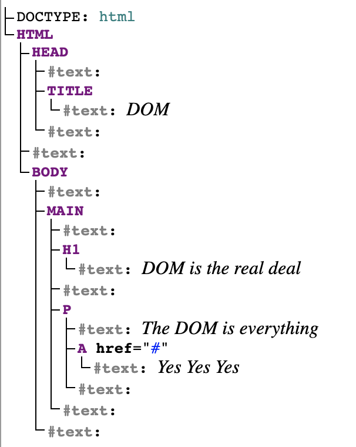

Credits go to [MDN client-side APIs](https://developer.mozilla.org/en-US/docs/Learn/JavaScript/Client-side_web_APIs).

# Introduction to Web APIs:
- This section is a high-level overview of APIs, how they work, how to use them and how they are structured. It also treats the different kinds of APIs.

## What is an API?
- **Application programming interfaces** are constructs available for programming languages that abstract complex code and make programming easier and convenient. It acts like a a socket. You just plug the thing in and you get electricity. No need to deal directly with the fascinating, complex and lethal world of electricity.
- Client-side JavaScript has many APIs. They are not part of the core JavaScript language but are built on top of it, adding much more power and great functionality to it. Client-side JavaScript APIs are generally divided into categories:
	+ **Browser APIs** are simply built into the browser and allow you interact with and manipulate the data in the browser and the system where the browser lives. These use complex lower level code written in C or Rust.
	+ **Third-party APIs** are not built into the browser and are generally pulled from somewhere in the web. Examples include the Github and Twitter APIs.
- What are the different components of the client-side JavaScript ecosystem and how do APIs fit into it. It largely consists of:
	+ **JavaScript** the language itself.
	+ **Browser APIs**.
	+ **Third-party APIs**.
	+ **JavaScript libraries** which are JavaScript files containing custom funtions that add to the functionality of your code. These include React, jQuery, etc.
	+ **JavaScript frameworks** such as Angular and Ember are packages of JavaScript along with HTML and CSS. They are like libraries but are characterized bu **inversion of control**. In libraries, the developer is in control and calls code from the library. The frameworks, on the other hand, are in control and they do call the developer's code.

## What Can APIs Do?
- Common browser APIs include:
	+ **APIs for manipulating documents**, chief among which is the **document object model (DOM)**. It is used for manipulating CSS and HTML.
	+ **APIs for fetching data from the server.** These update small subsections of the document without a whole browser refresh making a site feel more responsive. These are termed **Ajax** and include the important **`XMLHttpRequest`** and the **Fetch API**.
	+ **APIs for drawing  and manipulating graphics** include **Canvas** and **WebGL**
	+ **Audio and Video APIs** are used for manipulating audio and video.
	+ **Device APIs** allow for retrieving manipulating hardware data. These include the **Notifications** and **Vibration** APIs.
	+ **Client-side Storage APIs** allow you to store data in the client resulting in maintaining state between page loads and even working offline. These include simple name/value storage as in the case of the **Web Storage API** or more complex tabular data storage as in the case of the **IndexedDB API**.
- Common Third-party APIs include the **Twitter API**, **Google Map API**, **Youtube API**, etc.

## How Do APIs Work?
- Common features of JavaScript APIs are
+ **APIs are based objects** with members storing the API objects data and methods for interacting with the API and manipulating its data.
+ **They have recognizable entry points** such as the **Document** object, denoted with the keyword `document` which is the entry point to the DOM. Another entry point to the DOM is an instance of an HTML object. think for example of `p.textContent`.
+ **They use events to handle change in state**
+ **They might have additional security mechanisms.** Some APIs only work through HTTPS because they might include sensitive data such as the **Push API** and **Service Workers**. Some APIs ask for user permission such as the **Notifications API**.

# Manipulating Documents:
- The **DOM (Document Object Model)** is a set of APIs for controlling HTML and styling information that makes heavy use of the **Document** object. 

## The Important Parts of a Web Browser:
- Browsers are complicated mechanisms with many moving parts. Many such parts can't be directly manipulated using JavaScript, for security reasons and other reasons.
- Web APIs, however, give us access to a lot of functionality while abstracting away much of the internal complexity of a browser.
- A browser has 3 parts that are directly involved in viewing web pages:
	+ The **window** is basically a tab where the page is loaded. The JavaScript object **`Window`** is used to manipulate the window. Examples of things you can do with this object include getting the window's size with `Window.innerWidth` and `Window.innerHeight`, manipulating the document loaded into the window, storing client-side data in local storage, attaching an event handler to the current window, etc.
	+ The **navigator** represents the state and identity of the browser and is represented in JavaScript by the **`Navigator`** object. You can use it to retrieve thing such as the user's preferred language and streams from a webcam. 
	+ The **document** is the actual page loaded into the window (in JS it is **`Document`**). It allows you to manipulate the HTML and CSS in the page. You can create, add, remove elements. You can manipulate their content and styling, etc. 
- This article is focused mainly on manipulating the document.

## The Document Object Model:
- When a document is loaded in a tab, it is represented by a DOM. It is a "tree structure" that allows for easy access and manipulation of the HTML structure using a programming language.
- To get a  better idea of how the DOM works let's visualize it.
```xml
<!DOCTYPE html>
<html>
<head>
	<title>DOM</title>
</head>
<body>
	<main>
		<h1>
			DOM is the real deal
		</h1>
		<p>
			The DOM is everything <a href="#">Yes Yes Yes</a>
		</p>
	</main>
</body>
</html>
```
- Passing the code above through Ian Hickson's [Live DOM viewer](https://software.hixie.ch/utilities/js/live-dom-viewer/), yields the following nice break up of the DOM tree:

- We can see that each **element** or bit of **text** has its own entry in the tree. Each one of these is called a **node**. Node can be described in terms of their type and their position in the tree in relation to other nodes:
	+ **Element node** is an element as it exists in the DOM.
	+ **Root node** the top node of the tree, which is the `HTML` node in HTML. XML and SVG have their own root nodes.
	+ **Child node** is a direct descendant of another node.
	+ **Descendant node** A node anywhere inside a node.
	+ **Parent node** Any node that has another node inside it.
	+ **Sibling nodes** are nodes that sit on the same level inside the DOM tree.
	+ **Text node** is a node containing a text string.

## Basic DOM Manipulation:
- We have seen DOM manipulation methods all over the place. 

### Selecting Elements to Be Manipulated:
- To manipulate an element, you need to first select it and store a reference to it inside a variable as in the following example:
```javascript
let link = document.document.querySelector('a');
```
- Once stored in a variable, you can start manipulating it using the methods and properties available to it. These methods are defined in interfaces like `HTMLAnchorElement` for the `<a>` element. Thid interface inherits the `HTMLElement` interface which also inherits from the `Node` interface which represents any kind of Node in the DOM. You can readily see these properties and methods suggested by developer console in Firefox or Chrome. Our link element, for example, has such properties as `href` and `textContent`. 
- **`Document.querySelector()`** is the recommended modern way of selecting elements since it is based on CSS selectors. This method only matches the first matching element. To select all elements, you need **`Document.querySelectorAll()`**. This method matches every element of the given type and stores it in a list called **NodeList**. 
- There are other ways to select elements. These are older and would work in old browsers, but they are out of fashion. They include:
	+ **`Document.getElementById()`** selects an element by its id. It returns an element with the given id.
	+ **`Document.getElementsByTagName()`** selects an element by its tag name. It returns an array of the selected elements. 

### Creating and Placing New Nodes:
- The following code is a typical scenario where a node is created and placed in a specified location in the document:
```javascript
const section1 = document.querySelector('#section1');
const p = document.createElement('p');
p.textContent = "This is my first node";
section1.appendChild(p);
```
- You can also create a text node with **`Document.createTextNode()`** as in:
```javascript
const text = document.createTextNode('I\'m a text node');
```
- There are other methods to select elements based on their relative position or relation in a DOM tree to other specified elements.

### Moving and Removing Elements:
- **`Node.appendChild()` DOES LITERALLY MOVES AN ELEMENT FROM PART OF THE TREE TO ANOTHER**. If you select some element and append it to another element, the element is moved fromt its original location and not just copied.
- To copy an element, you can use **`Node.cloneNode()`** to make the copy and then append it where you want as in:
```javascript
const copyLink = link.cloneNode(true);
p.appendChild(copyLink)
```
- Instead of moving an element around, the `cloneNode()` method makes a copy which can then be appended where need be.
- Removing a node is straightforward. It can be removed using a reference to its parent and itself as the following snippet shows:
```javascript
section1.removeChild(p);
```
- It can also be done using a reference to the element to be removed as in:
```javascript
p.remove();
```
- This last method is not available in older browsers. If you don't know the parent node of the element you want to remove, you can use the **`parentNode`** property as follows:
```javascript
p.parentNode.removeChild(p);
```

### Manipulating Styles:
- There are multiple ways styling can be manipulated.
- The **`Document.stylesheets`** returns an array of **`CSSStyleSheet`** objects. You can access these objects and change them as you wish, but this is an outdated and hard way to manipulate styles.
- The cooler and more standard way of styling these days is done withe the **`HTMLElement.style`** property which can be used to manipulate the styling of an element directly as in:
```javascript
p.style.color = 'red';
p.style.backgroundColor = 'yellow';
```
- Notice that while CSS properties have have a dash in the middle as in `background-color`, JavaScript style properties are camelcased (`backgroundColor`).
- Another, I would say ingenious method to change styling is through the use of **`Element.setAttribute()`** which sets an attribute to an element. This method usage is not restricted to styling but is general. It takes a parameters, one for the attribute and the second one for desired value to be set to the element. Let's say you have a predefined class `focused` you want to add to some element. You can simply do with the following snippet:
```javascript
textInput.setAttribute('class', 'focused');
```

## Getting Useful Information from the Window Object:
- The following almost self-explanatory example shows how the `Window` object can be used to change the style of an element:
```javascript
window.onresize = function() {
  winWidth = window.innerWidth;
  winHeight = window.innerHeight;
  div.style.width = winWidth + 'px';
  div.style.height = winHeight + 'px';
}
```
- This is freaking cool.

## A Dynamic Shopping List:
- I will attempt making this shopping list on my own and compare my results to the one given by MDN. 
- This was easy. It took just a few minutes. The result can be found my [codepen](https://codepen.io/ahmaazouzi/pen/XWJxJmm).

# Fetching Data from the Server:
# Third Party APIs
# Client-side Storage.
